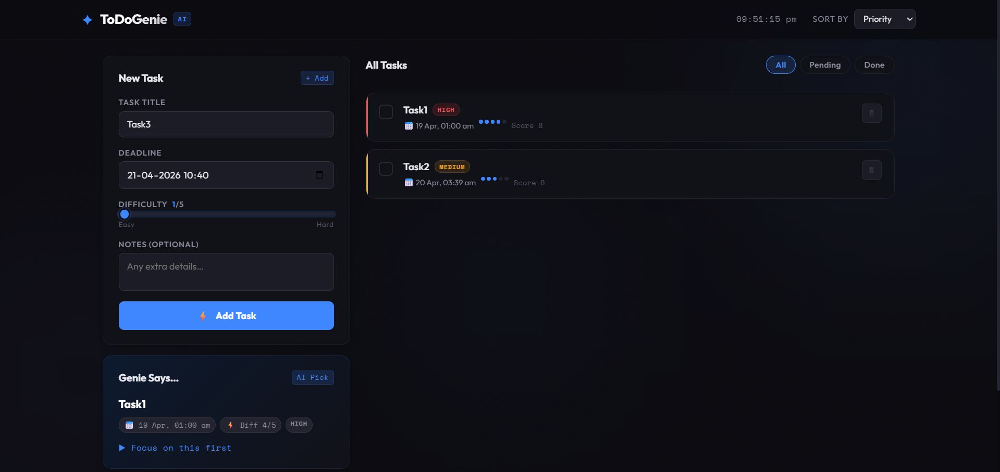
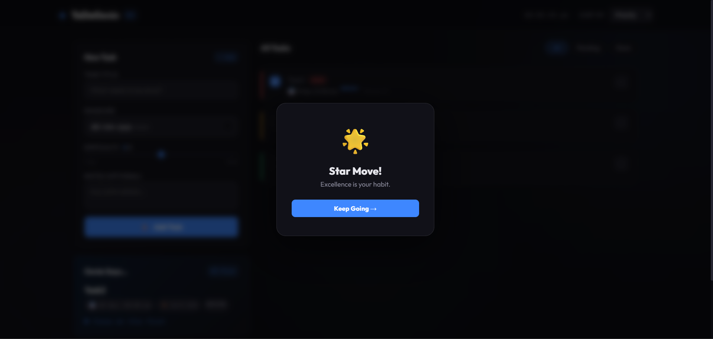

ToDoGenie — AI-Powered Smart Task Manager

Stop guessing what to do next. Let your Genie decide.

ToDoGenie is a full-stack task management web application that intelligently prioritizes your tasks using a custom-built scoring algorithm based on deadline urgency and task difficulty.

Instead of manually deciding what to do next, ToDoGenie tells you — instantly.

-Live Demo

*Coming Soon (Deploying on Render)*

-GitHub Repository

https://github.com/Dixit876/todogenie

-Screenshots

Main Dashboard

Genie Recommendation System

 Task Completion Feedback

 Features

* Smart Priority Engine
  Automatically scores tasks based on urgency and difficulty

* Genie Says Recommendation
  Always shows the most important task to work on next

* Real-Time Deadline Alerts
  Visual warnings when deadlines are near

* Completion Celebrations
  Motivational feedback on task completion

* Sort & Filter System
  Sort by priority, deadline, or difficulty

* Live Stats Dashboard
  Track total, completed, and pending tasks

* Premium Dark UI
  Clean, responsive, and modern interface

-How the Priority Algorithm Works

Each task is assigned a **Priority Score:

Priority Score = Urgency Score (1–5) + Difficulty Score (1–5)

Urgency Scoring

| Time Until Deadline | Score | Level       |
| ------------------- | ----- | ----------- |
| < 3 hours / overdue | 5     | Critical    |
| 3 – 24 hours        | 4     | Very Urgent |
| 1 – 3 days          | 3     | Urgent      |
| 3 – 7 days          | 2     | Moderate    |
| > 7 days            | 1     | Relaxed     |

Final Priority Levels

| Score  | Priority  |
| ------ | --------- |
| 8 – 10 |  High   |
| 5 – 7  |  Medium |
| 2 – 4  |  Low    |

The Genie Says panel always recommends the highest-scoring incomplete task.

- Tech Stack

| Layer    | Technology                        |
| -------- | --------------------------------- |
| Backend  | Python, Flask                     |
| Database | SQLite                            |
| Frontend | HTML5, CSS3, JavaScript           |
| UI/UX    | Custom Dark Theme                 |
| Fonts    | Google Fonts (Outfit, Space Mono) |

---

- Project Structure

todogenie/
│
├── app.py              # Flask app & API routes
├── model.py            # Priority scoring logic
├── database.db         # SQLite DB (auto-generated)
├── requirements.txt    # Dependencies
│
├── templates/
│   └── index.html      # UI layout
│
├── static/
│   ├── style.css       # UI styling
│   └── script.js       # Frontend logic

- Run Locally

bash
git clone https://github.com/Dixit876/todogenie.git
cd todogenie
pip install -r requirements.txt
python app.py

-Open in browser:
http://localhost:5000

 SQLite database is created automatically

---

-API Endpoints

| Method | Endpoint        | Description        |
| ------ | --------------- | ------------------ |
| GET    | /api/tasks      | Fetch all tasks    |
| POST   | /api/tasks      | Create a new task  |
| PATCH  | /api/tasks/<id> | Update task status |
| DELETE | /api/tasks/<id> | Delete task        |

- Roadmap

* [ ] User Authentication (Login/Signup)
* [ ] React Frontend Migration
* [ ] Advanced Analytics Dashboard
* [ ] Email / Push Notifications
* [ ] Mobile App (React Native)
* [ ] Export Tasks (CSV / PDF)

- Author

Dixit
🎓 B.Tech CSE (AI), Chitkara University

* GitHub: https://github.com/Dixit876
* LinkedIn: ADD_YOUR_LINKEDIN

- Inspiration

> *“I have tasks… but what should I do first?”*

ToDoGenie solves this using logic + automation.

 If you like this project, consider starring the repo!
